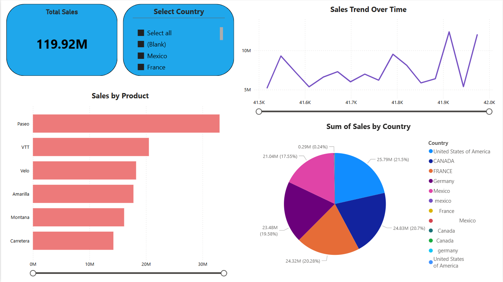

# Sales Analysis Power BI Dashboard

## Project Overview
This project presents an interactive Power BI dashboard created using sales data to analyze:
- Total sales performance
- Sales trends over time
- Product-wise sales
- Country-wise sales distribution

## Tools Used
- Power BI
- Excel
- Data Visualization

## Dashboard Preview

## Files Included
- `Sales_Dashboard.pbix` – Power BI dashboard file  
- `Financial Sample Data.xlsx` – Dataset used  
- `dashboard.png` – Dashboard screenshot

## How to View
1. Download the `.pbix` file
2. Open it using **Power BI Desktop**
